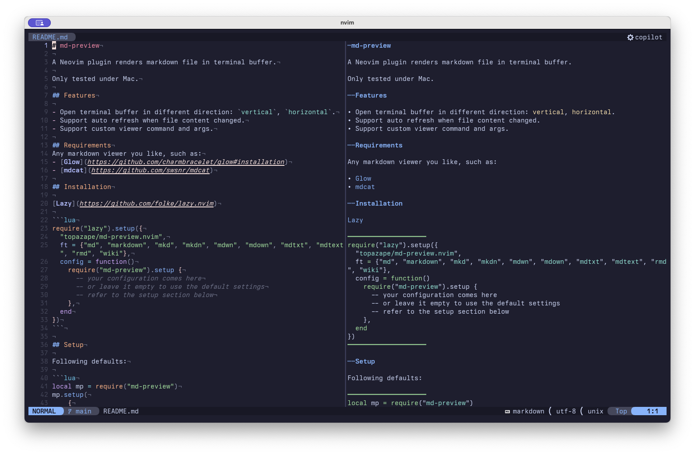

# md-preview

A Neovim plugin renders markdown file in terminal buffer.

Only tested under Mac.



## Features

- Open terminal buffer in different direction: `vertical`, `horizontal`.
- Support auto refresh when file content changed.
- Support custom viewer command and args.

## Requirements
Any markdown viewer you like, such as:
- [Glow](https://github.com/charmbracelet/glow#installation)
- [mdcat](https://github.com/swsnr/mdcat)

## Installation

[Lazy](https://github.com/folke/lazy.nvim)

```lua
require("lazy").setup({
  "topazape/md-preview.nvim",
  ft = {"md", "markdown", "mkd", "mkdn", "mdwn", "mdown", "mdtxt", "mdtext", "rmd", "wiki"},
  config = function()
    require("md-preview").setup {
      -- your configuration comes here
      -- or leave it empty to use the default settings
      -- refer to the setup section below
    },
  end
})
```

## Setup

Following defaults:

```lua
local mp = require("md-preview")
mp.setup({
      viewer = {
        exec = "mdcat", -- or "glow"
        exec_path = "",
        args = { "--local" }, -- if you choose glow, set like: { "-s", "dark" }
      },
      -- Markdown preview term
      term = {
        -- reload term when rendered markdown file changed
        reload = {
          enable = true,
          events = {"InsertLeave", "TextChanged"},
        },
        direction = "vertical", -- choices: vertical / horizontal
        keys = {
        close = {"q"},
        refresh = "r",
        }
      }
    })
```

## Commands

- `:MPToggle`: toggle markdown preview open or close.
- `:MPOpen`: open markdown preview window.
- `:MPClose`: close markdown preview window.
- `:MPRefresh`: refresh markdown preview window.

## Thanks

[markdown-preview.nvim](https://github.com/0x00-ketsu/markdown-preview.nvim)

## License

MIT
